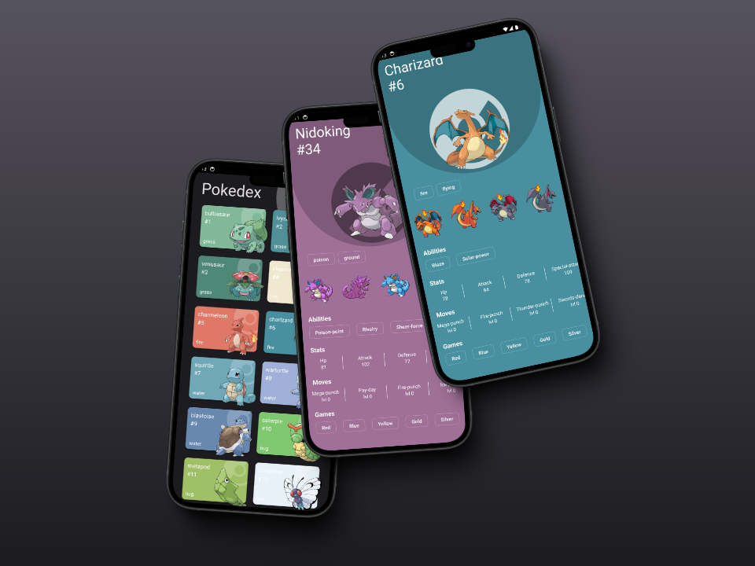

# Pokedex

Bienvenido a **Pokedex**, una aplicación desarrollada con **React Native CLI** para mostrar información de los Pokémons de forma interactiva y elegante. Este proyecto fue creado como parte de mi aprendizaje en React Native, aprovechando mis conocimientos previos en React.

Además, este proyecto forma parte del curso de **React Native** impartido por [Fernando Herrera](https://cursos.devtalles.com/courses/react-native).

## Descripción

La aplicación permite:
- Ver una lista de cartas (cards) de Pokémons en la pantalla de inicio.
- Explorar los detalles de cada Pokémon al presionar su card.
- Disfrutar de un diseño intuitivo y elegante.

## Características

- **Consumo de APIs**: Obtenemos información en tiempo real utilizando una API pública de Pokémons.
- **Reutilización de componentes**: Código modular y mantenible.
- **Gestión de datos eficiente con TanStack Query**:
  - `useQuery` para consultas simples.
  - `useInfiniteQuery` para la implementación de scroll infinito.
- **Carga perezosa de imágenes**: Mejora el rendimiento y la experiencia del usuario.
- **Manejo de caché**: Minimiza las solicitudes redundantes al servidor.
- **Diseño atractivo**: Aplicación de buenas prácticas de UI/UX.

## Capturas de Pantalla

*Pantalla de inicio con una lista de Pokémons.*

*Vista detallada de algunos Pokémons.*

> **Nota:** Asegúrate de incluir las imágenes en la carpeta del proyecto y ajustar las rutas en el markdown.

## Tecnologías y Herramientas

-React Native CLI
-TanStack Query
-TypeScript
-Gestión de estado y hooks avanzados

## Contribuciones

Este es un proyecto personal, pero si tienes sugerencias o encuentras errores, ¡los pull requests son bienvenidos! 🙌
